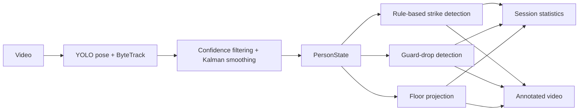

# Kickboxing Analysis


A Python computer-vision prototype for analysing **single-fighter shadowboxing footage**.

The app uses pose tracking and rule-based motion analysis to identify strike events, flag periods where both hands are below shoulder level, and project ankle movement onto a selected floor area. It produces annotated video, session-level strike statistics, guard statistics, and a footwork heatmap.

> This is a heuristic prototype, not a validated coaching or biomechanical measurement tool. Results depend on pose-tracking quality, camera position, calibration, and the fighter remaining visible.


## What it does

- Tracks people in video using YOLO pose estimation and ByteTrack.
- Selects the longest-lived track as the fighter.
- Applies confidence filtering and a constant-velocity Kalman filter to pose keypoints.
- Detects left/right straights, hooks, uppercuts, and kicks using motion and geometric rules.
- Flags frames where both wrists fall below a torso-scaled shoulder threshold.
- Produces strike counts, rates, speeds, combinations, pacing, and left/right or lead/rear balance.
- Lets the user mark four floor corners to create a footwork heatmap and movement statistics.
- Produces an annotated video with pose, tracking, strike, guard, and distance overlays.
- Caches tracked pose data in compressed `.npz` files to avoid rerunning pose inference for the same cached input.

## Intended input

The tool is designed for:

- One person in frame.
- Shadowboxing rather than sparring, pads, bags, or competition footage.
- Stable camera position.
- A full or near-full body view, including both ankles.
- Visible floor boundaries if footwork analysis is required.

It is not designed to identify a particular fighter in multi-person footage or to analyse live bouts reliably.

## How it works



1. YOLO pose tracking finds people and pose keypoints in each frame.
2. The longest-lived track is selected for analysis.
3. Low-confidence keypoints are removed and valid positions are smoothed.
4. Strike detectors identify speed peaks and apply pose-geometry conditions:
   - straights: wrist speed and arm extension
   - hooks: wrist sweep and elbow angle
   - uppercuts: upward wrist movement and compact arm geometry
   - kicks: ankle speed, leg geometry, and foot height
5. The application calculates session statistics and, when floor corners are supplied, projects ankle motion into a floor coordinate system.

## Outputs

| Output | Contents |
| --- | --- |
| Annotated video | Tracking box, skeleton, strike labels, guard labels, combo labels, and optional distance overlay. |
| Strike statistics | Total strikes; counts and rates by side/type; average and maximum estimated speed; strike mix; lead/rear and left/right balance; combo count and length; pacing; rhythm; mean gap and longest rest. |
| Guard statistics | Estimated guard-up time, guard-up percentage, and count/timing of periods where both hands are below the configured threshold. |
| Footwork statistics | Floor coverage, estimated stance width, stance-width variation, estimated cumulative distance, and a movement heatmap. |
| Pose cache | Compressed keypoints, boxes, confidence values, and metadata stored as `.npz`. |

## Installation

Requirements:

- Python 3.12+
- [uv](https://docs.astral.sh/uv/)
- `ffmpeg` with `libx264` on `PATH` for browser-friendly H.264 annotated video

```bash
uv sync
```

Run the Streamlit app:

```bash
uv run streamlit run app.py
```

The application will load `yolo26s-pose.pt`. If the model weights are not already available, Ultralytics may download them on first use.

## Using the app

1. Upload an MP4, MOV, or AVI video.
2. Enter the fighter's details, especially height.
3. Select orthodox or southpaw stance.
4. Run the analysis.
5. For footwork, select the four floor corners in this order: `left-near`, `left-far`, `right-near`, `right-far`.
6. Optionally enter floor dimensions to express footwork results in metres.
7. Review the annotated video, session metrics, and footwork visualisation.

## Python usage

```python
from pathlib import Path

import kickboxing_analysis as kba

person = kba.Person(
    name="Fighter",
    height_m=1.83,
    wingspan_m=None,
    weight=None,
    stance="orthodox",
)

result = kba.analyse_video(
    video_path=Path("clip.mp4"),
    person=person,
    cache_path=Path("cache/clip.npz"),
    # Use "deepocsort.yaml" to prioritise consistent fighter IDs through clinches.
    config=kba.Config(tracker="deepocsort.yaml"),
    strike_config=kba.StrikeConfig(),
)

stats = kba.StrikingStatsCalculator(
    result.person_state,
    result.strike_detections,
    kba.StrikeConfig(),
).calculate_striking_stats()

print(stats.total_strikes)
print(stats.strike_mix)
```

## Floor projection

Footwork analysis maps the ankles from image coordinates onto a user-selected floor quadrilateral.



Metric estimates are more credible when:

- The floor is approximately rectangular.
- The camera remains fixed.
- The floor edges are visible.
- At least two side lengths are known.
- Perspective is present; a straight-on camera angle can make width estimation ambiguous.

If floor dimensions are unavailable, the application uses a unit-square projection. Those results should be interpreted as relative position and coverage, not metres.

## Limitations

- The detector uses 2D pose data and fixed heuristic thresholds.
- It does not estimate 3D joint motion, force, impact, or true strike velocity.
- Estimated speeds rely on torso-based scale assumptions and therefore are not validated biomechanical measurements.
- Occlusion, motion blur, camera movement, clothing, framing, and pose-estimation errors can change results.
- The tool is intended for one fighter in frame; multi-person scenes can cause track selection or attribution errors.
- Guard detection currently defines a drop as **both** wrists being sufficiently below their corresponding shoulders.
- Footwork metrics depend on manually selected floor corners and camera geometry.
- No labelled benchmark dataset, precision/recall metrics, or external validation study is currently included.

## Data, privacy, and content rights

Users should only upload footage they are authorised to process and share.

The application creates temporary video files and may persist pose-tracking caches locally. Avoid uploading footage containing people who have not consented to analysis, or footage containing sensitive personal information.

No third-party video assets are included in the Git repository.

## Project structure

```text
app.py                              # Streamlit application
src/
├── download_clip.py                # Optional command-line clip downloader
└── kickboxing_analysis/
    ├── pipeline.py                 # Video analysis and annotation workflow
    ├── tracking.py                 # YOLO tracking, PersonState, Kalman smoothing
    ├── features.py                 # Speeds, angles, calibration helpers
    ├── strike_detectors.py         # Straight, hook, uppercut, and kick rules
    ├── strike_analysis.py          # Detection arbitration
    ├── striking_stats.py           # Strike statistics
    ├── defense_*.py                # Guard-drop logic and statistics
    ├── footwork_*.py               # Projection, heatmap, and footwork statistics
    ├── annotator.py                # Video overlay rendering
    ├── cache.py                    # Pose-cache serialisation
    └── config.py                   # Analysis thresholds and configuration
tests/                              # Unit tests
docs/                               # README assets
Dockerfile                          # Container build
```

## Development

```bash
uv run pytest
uv run ruff check .
uv run ruff format .
```

## Evaluation status

The repository includes unit tests for selected motion features and strike-detection scenarios using synthetic pose tracks.

It does not yet include:

- labelled video ground truth;
- precision, recall, F1, or confusion matrices;
- per-strike-class error analysis;
- end-to-end tests against real videos;
- a comparison with manual annotation;
- validation of speed, distance, or floor-calibration estimates.

Any future performance claims should include the dataset, annotation protocol, evaluation split, metric definitions, and examples of failure cases.

## Licence

Licensed under the Apache License, Version 2.0. See [LICENSE](LICENSE).
