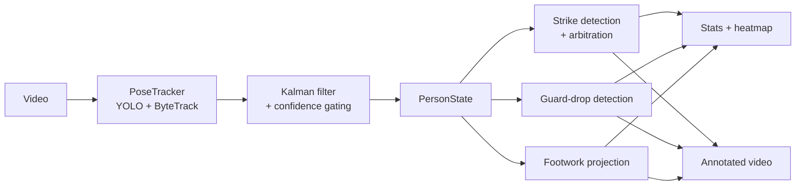

# Kickboxing analysis tool


A tool to analyse your shadowboxing. Point it at a video of someone **shadowboxing**, and it breaks down their
striking, defence and footwork. It tracks the fighter's pose, picks out the
strikes they throw, flags when the guard drops, maps where they move, and hands
back stats, a heatmap and an annotated video. It's built for solo work, so it
assumes one fighter in frame with no opponent, bag or pads.


Most people will just use the Streamlit app (`app.py`). The analysis code lives
in `src/kickboxing_analysis` if you'd rather call it from Python.

## Features

- Detects straights, hooks, uppercuts and kicks on both sides. When two fire at
  once a straight beats a hook, and arm-swings near a kick get suppressed so they
  don't count as punches.
- Striking stats: counts, rates, peak and average speed in m/s, combos with
  their average length and your most-thrown combinations, a lead/rear and
  left/right hand balance, a punch/kick split, work-rate numbers (busiest
  window, mean gap, longest rest, time to first strike), a per-strike speed
  timeline, a pacing histogram, a rhythm score, and a fatigue read on how much
  strike speed faded across the session.
- Guard-drop detection for when both hands fall below the shoulders, with the
  time of each drop and the total guard-up time.
- Footwork: the ankles get projected onto the floor for a movement heatmap, plus
  floor coverage, stance width and distance travelled. Results are in metres if
  you give the floor edge lengths, otherwise a unit square.
- An annotated video with the skeleton, tracking box, strike, combo and guard
  labels and a running distance counter. Written as H.264 if ffmpeg is around.
- Tracking gets cached to an `.npz` file, so re-running the same clip skips the
  model pass.

## How it works



1. `PoseTracker` runs YOLO pose with ByteTrack over the video. Whichever track
   shows up in the most frames is taken to be the fighter.
2. Drop the low-confidence keypoints, then smooth each one with a
   constant-velocity Kalman filter. Short gaps in the track are bridged by
   holding the last valid position.
3. Each detector finds peaks in a joint's speed and checks them against a few
   geometric conditions (arm extension and bend, shoulder rotation, shin angle,
   foot height). `StrikeAnalyser` sorts out any overlaps afterwards.
4. The stats calculators turn the detection masks into numbers, the footwork
   pipeline builds the heatmap, and it all ends up in the app and on the
   annotated video.

## Project structure

```
app.py                    # Streamlit app (main entry point)
src/
├── download_clip.py      # Trims a YouTube clip with yt-dlp
└── kickboxing_analysis/  # Analysis library (the installed package)
    ├── pipeline.py       # analyse_video / render_annotated_video
    ├── tracking.py       # PoseTracker, PersonState, Kalman filter
    ├── features.py       # Joint speeds, angles, scale calibration
    ├── strike_detectors.py / strike_analysis.py   # detection + arbitration
    ├── striking_stats.py / defense_*.py           # stats
    ├── footwork_*.py     # floor projection, heatmap, footwork stats
    ├── annotator.py      # Draws the annotations onto the video
    ├── config.py         # Config / StrikeConfig / DefenseConfig / FootworkConfig
    └── cache.py, video.py, geometry.py, constants.py, inspector.py
tests/                    # pytest suite
models/                   # YOLO pose weights
```

## Installation

Needs Python 3.12+ and [uv](https://docs.astral.sh/uv/):

```bash
uv sync
```

That pulls in the `kickboxing_analysis` package and everything it needs
(`ultralytics`, `opencv-python`, `numpy`, `scipy`, `pandas`, `matplotlib`,
`seaborn`, `streamlit`).

The app loads `yolo26s-pose.pt`, kept in `models/`; if it's missing ultralytics
grabs a checkpoint on first use. To get a video the browser can actually play,
you need ffmpeg with the `libx264` encoder on `PATH`. Without it the writer falls
back to `mp4v`, which most browsers won't touch.

## Usage

Run the app with:

```bash
uv run streamlit run app.py
```

Upload a video, fill in the fighter's name and height (wingspan, weight and
stance are optional for now), then hit Analyse. For footwork, click the four
floor corners in the order left-near, left-far, right-near, right-far. Enter the
real length of each side in metres if you want the results in metres instead of a
unit square.

To call it from Python:

```python
from pathlib import Path
import kickboxing_analysis as kba

person = kba.Person(name="Fighter", height_m=1.83, wingspan_m=1.88,
                    weight=66, stance="orthodox")

result = kba.analyse_video(
    video_path=Path("clip.mp4"),
    person=person,
    cache_path=Path("outputs/clip.npz"),
    model="yolo26s-pose.pt",
    config=kba.Config(),
    strike_config=kba.StrikeConfig(),
)

for r in result.strike_records:          # the strikes thrown, in order
    print(f"{r['time_s']:.2f}s  {r['side']} {r['strike_type']}")

stats = kba.StrikingStatsCalculator(
    result.person_state, result.strike_detections, kba.StrikeConfig()
).calculate_striking_stats()
```

`python -m kickboxing_analysis.main` runs the same pipeline as a plain script,
just with hard-coded paths and floor corners. Edit its `__main__` block to point
it at your own clip.

## Configuration

All the thresholds live in four frozen dataclasses in
[config.py](src/kickboxing_analysis/config.py). The defaults are tuned for normal
shadowboxing footage; pass your own instances into `analyse_video` to override
them.

- `Config` covers the pose tracking: the keypoint confidence cutoff and the
  smoothing window.
- `StrikeConfig` covers the detector thresholds: the speed bands in m/s and the
  geometric angles per strike, the windows for suppressing punches around a kick,
  the gap needed between two peaks, and `max_hold`, the longest tracking gap
  that gets bridged.
- `DefenseConfig` is just how far below the shoulder a wrist has to fall, in
  torso lengths, before it counts as a dropped guard.
- `FootworkConfig` covers the kick and check filter window, the step threshold
  that ignores jitter, and the ankle-height and knee-angle cutoffs for deciding
  when a foot is off the ground.

## Some detail

Scale comes from the body, not from any camera calibration. Each frame the torso
length (centre of the shoulders to centre of the hips) is measured in pixels and
converted to metres with `torso ≈ 0.3 × height`. That gives a pixels-to-metres
ratio per frame, so a threshold set in m/s gets rescaled to pixels frame by
frame.

Every detector works the same way. It finds peaks in a joint's speed with
`scipy.signal.find_peaks`, drops anything above a max speed as a glitch, and
checks what's left against geometry. A straight wants a fast wrist extending with
the elbow near straight; a hook wants a fast angular sweep towards the opposite
shoulder with the elbow bent; an uppercut wants fast upward travel from a compact
guard; a kick wants a fast ankle, a wide angle between the shins, and the foot
raised.

For footwork, two traced floor edges give you four corners and a homography onto
a unit square, or a metric rectangle once the edge lengths are known. The width
is recovered from the depth using the vanishing points and the image centre.
Airborne frames get dropped before the heatmap and stats go together.

## Outputs

| Output | What's in it |
| --- | --- |
| Annotated video | Skeleton, box, strike, combo and guard labels, distance counter. |
| Cache (`.npz`) | Keypoints, boxes and metadata, reused on the next run. |
| `StrikingStats` | Counts, rates, max and average speeds, combos and top sequences, hand balance, punch/kick mix, work rate, fatigue, rhythm, pacing, speed timelines. |
| `GuardStats` | Guard-up time and percentage, drop count, per-drop timings. |
| `FootworkStats` + figure | Floor coverage, stance width and its spread, distance, heatmap. |

## Limitations

- Only works when there is one person in the video frame. Having another person affect the model's results
- It's 2D and the detection is heuristic. The scale assumes an upright torso
  , the camera is at shoulder height, and the thresholds are fixed
- The floor calibration assumes the camera stays still through the clip.

## Development

```bash
uv run pytest          # tests
uv run ruff check .    # lint
uv run ruff format .   # format
```

## License

Licensed under the Apache License, Version 2.0. See [LICENSE](LICENSE) for the
full text.
