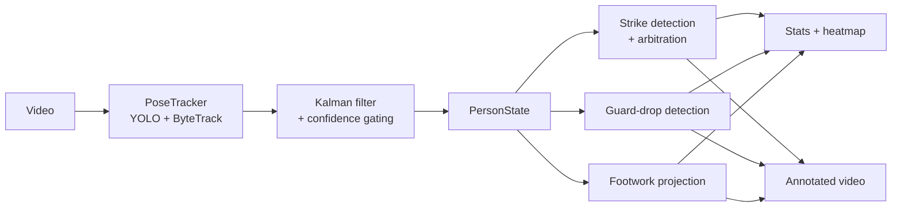

# MMA Striking Detector

Analyses a kickboxer's striking, defense and footwork from a video of a single
fighter. It tracks the fighter's pose, detects the strikes they throw, flags
when their guard drops, maps their footwork, and reports the results as
statistics, a heatmap and an annotated video.

Everything is worked out from 2D pose keypoints, so there is no manual
labelling. Real-world scale is taken from the fighter's own body: the torso
length in pixels together with their known height gives a pixels-to-metres ratio
for each frame, so strike speeds come out in metres per second and stay
comparable however far the fighter is from the camera.

The main way to use it is the Streamlit app (`app.py`). The analysis code lives
in `src/strike_analysis` and can also be called directly from Python.

## Features

- Detects straights, hooks, uppercuts and kicks, on the left and right side. If
  more than one is detected at once a straight takes priority over a hook, and
  arm-swings around a kick are suppressed so they aren't counted as punches.
- Striking stats: counts, rates, peak speed in m/s, combos, a per-strike speed
  timeline, a pacing histogram and a rhythm score.
- Guard-drop detection for when both hands fall below the shoulders, with the
  time of each drop and the total guard-up time.
- Footwork analysis: the ankles are projected onto the floor to give a movement
  heatmap, floor coverage, stance width and distance travelled. Results are in
  metres if the floor edge lengths are given, otherwise a unit square.
- An annotated video with the skeleton, tracking box, strike, combo and guard
  labels and a running distance counter. Written as H.264 when ffmpeg is around.
- Tracking is cached to an `.npz` file, so re-running on the same clip skips the
  model pass.

## How it works



1. `PoseTracker` runs YOLO pose with ByteTrack over the video. The fighter is
   taken to be the track seen in the most frames.
2. Low-confidence keypoints are dropped, then each keypoint is smoothed with a
   constant-velocity Kalman filter. Short tracking gaps are bridged by holding
   the last valid position.
3. Each detector finds peaks in a joint's speed and checks them against a few
   geometric conditions (arm extension and bend, shoulder rotation, shin angle,
   foot height). `StrikeAnalyser` then sorts out any overlaps.
4. The stats calculators turn the detection masks into numbers, the footwork
   pipeline builds the heatmap, and everything is shown in the app and drawn
   onto the annotated video.

## Project structure

```
app.py                    # Streamlit app (main entry point)
src/
├── download_clip.py      # Trims a YouTube clip with yt-dlp
└── strike_analysis/      # Analysis library (the installed package)
    ├── pipeline.py       # analyse_video / render_annotated_video
    ├── tracking.py       # PoseTracker, PersonState, Kalman filter
    ├── features.py       # Joint speeds, angles, scale calibration
    ├── strike_detectors.py / strike_analysis.py   # detection + arbitration
    ├── striking_stats.py / defense_*.py           # stats
    ├── footwork_*.py     # floor projection, heatmap, footwork stats
    ├── annotator.py      # Draws the annotations onto the video
    ├── config.py         # Config / StrikeConfig / DefenseConfig / FootworkConfig
    └── cache.py, video.py, geometry.py, constants.py, inspector.py
tests/                    # pytest suite
models/                   # YOLO pose weights
```

## Installation

Needs Python 3.14+ and [uv](https://docs.astral.sh/uv/):

```bash
uv sync
```

This installs the `strike_analysis` package and its dependencies (`ultralytics`,
`opencv-python`, `numpy`, `scipy`, `pandas`, `matplotlib`, `seaborn`,
`streamlit`).

The app loads `yolo26s-pose.pt`, which is also kept in `models/`; ultralytics
downloads a checkpoint on first use if it isn't there. For a video the browser
can play, ffmpeg with the `libx264` encoder needs to be on `PATH`. Without it
the writer falls back to the `mp4v` codec, which most browsers won't play.

## Usage

Run the app with:

```bash
uv run streamlit run app.py
```

Upload a video, fill in the fighter's name, height (wingspan, weight and stance,
are currently optional), then press Analyse. For footwork, click the four floor corners in the order
left-near, left-far, right-near, right-far. You can also enter the real length
of each side in metres to get results in metres rather than a unit square.

To call it from Python:

```python
from pathlib import Path
import strike_analysis as sa

person = sa.Person(name="Fighter", height_m=1.83, wingspan_m=1.88,
                   weight=66, stance="orthodox")

result = sa.analyse_video(
    video_path=Path("clip.mp4"),
    person=person,
    cache_path=Path("outputs/clip.npz"),
    model="yolo26s-pose.pt",
    config=sa.Config(),
    strike_config=sa.StrikeConfig(),
)

for r in result.strike_records:          # the strikes thrown, in order
    print(f"{r['time_s']:.2f}s  {r['side']} {r['strike_type']}")

stats = sa.StrikingStatsCalculator(
    result.person_state, result.strike_detections, sa.StrikeConfig()
).calculate_striking_stats()
```

`python -m strike_analysis.main` runs the same pipeline as a script, but with
hard-coded paths and floor corners. Edit its `__main__` block to point at your
own clip.

## Configuration

The thresholds live in four frozen dataclasses in
[config.py](src/strike_analysis/config.py). The defaults are set for ordinary
kickboxing footage; pass your own instances into `analyse_video` to change them.

- `Config` is the pose tracking: the keypoint confidence cutoff and the
  smoothing window.
- `StrikeConfig` is the detector thresholds: the speed bands in m/s and the
  geometric angles for each strike, the windows used to suppress punches around
  a kick, the gap needed between two peaks, and `max_hold`, the longest tracking
  gap that gets bridged.
- `DefenseConfig` is how far below the shoulder a wrist has to fall, measured in
  torso lengths, before it counts as a dropped guard.
- `FootworkConfig` is the kick and check filter window, the step threshold that
  ignores jitter, and the ankle-height and knee-angle cutoffs that decide when a
  foot is off the ground.

## Some detail

The scale is taken from the body, there is no camera calibration. The torso
length, from the centre of the shoulders to the centre of the hips, is measured
in pixels each frame and turned into metres with `torso ≈ 0.3 × height`. That
gives a pixels-to-metres ratio per frame, so a speed threshold set in m/s is
rescaled to pixels for every frame.

The detectors all work the same way. They find peaks in a joint's speed with
`scipy.signal.find_peaks`, throw out spikes above a maximum speed as glitches,
and check the rest against geometry: a straight needs a fast wrist that is
extending with the elbow near straight; a hook needs a fast angular sweep of the
wrist towards the opposite shoulder with the elbow bent; an uppercut needs fast
upward travel from a compact guard; a kick needs a fast ankle with a wide angle
between the shins and the foot raised.

For footwork, two traced floor edges give four corners and a homography onto
either a unit square or, when the edge lengths are known, a metric rectangle.
The width is recovered from the depth using the vanishing points and the image
centre. Airborne frames are dropped before the heatmap and stats are built.

## Outputs

| Output | What's in it |
| --- | --- |
| Annotated video | Skeleton, box, strike, combo and guard labels, distance counter. |
| Cache (`.npz`) | Keypoints, boxes and metadata, reused on the next run. |
| `StrikingStats` | Counts, rates, max speeds, combos, rhythm, pacing, speed timelines. |
| `GuardStats` | Guard-up time and percentage, drop count, per-drop timings. |
| `FootworkStats` + figure | Floor coverage, stance width and its spread, distance, heatmap. |

## Tests

The tests run against the library on their own, no video or weights needed, as a
fixture makes up the keypoint tracks:

```bash
uv run pytest
```

They cover the feature maths, the four detectors with cases that should and
shouldn't fire, the arbitration around kicks, the strike records, the footwork
stats, and the floor projection under a couple of camera models.

## Limitations

- One fighter at a time. It picks the most-tracked person, so it isn't meant for
  sparring footage.
- It's 2D and the detection is heuristic. The scale assumes an upright torso
  roughly facing the camera, and the detectors use fixed thresholds, so odd
  strikes can be missed and the kick suppression can drop a real punch thrown
  next to a kick.
- Footwork is only in metres if the floor edge lengths are given, otherwise it's
  in unit-square terms and not comparable between clips.
- The floor calibration assumes the camera doesn't move during the clip.

## Development

```bash
uv run pytest          # tests
uv run ruff check .    # lint
uv run ruff format .   # format
```
